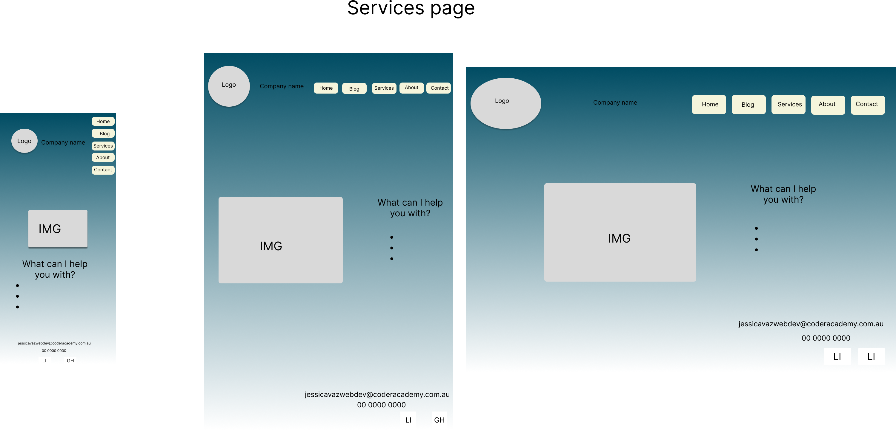

# Portfolio-T1A2 - Jessica Vaz

## Links for Netlify and GitHub:

[Netflify](https://jessicavaz-t1a2.netlify.app/)

[GitHub](https://github.com/Jessicavazm/portfolio-t1a2)

## Tech stack
* HTML
* CSS
* GitHub
* Netlify
* Figma
* Draw.io
* Trello

## Purpose 
This is a website to present myself as a web developer. It contains my resume, what types of services I'm offering as an IT professional and blog page that contains 5 blog posts. In this website, I will be demonstrating my abilities with what I have learnt from the month in web programming.

## Functionality/ features
My website features a simple design which is clear to the viewers. I have included a navigation bar in all pages that facilitates navigation between different pages, along external links to connect with me placed in the footer of each page. I have created different CSS layout depending on the screen size to optimaze the user experience and applied an animation to my logo to make it more fun. On smaller screens, I have the components in a column and in bigger screens components switches to row direction instead. I also increased font sizes as the screen gets bigger. My decision making to the overall aesthetic of the website was to keep things simple and try to understanding each step, I have used the online classes to help me build the website and now that I understand a little bit more about web programming I should be able to improve the overall aesthetic and functionality of my next project.
 
 ## Target audience
 My target audience is my future employer, my tutors and colleagues from Coder Academy. My photos has been picked from Unplash.

## Components

### Header
The header component has a logo created by myself along my name. The navigation bar has links to navigate through different pages on the website.

### Home page
The home page has an image that shows someone typing on a computer, along with the image there's a small brief of myself and what you can expect from the website.

### Blog Page
The blog page has 5 blogs carts with an image, heading, published date and a brief text each. Underneath the text there's a " Read more " button that takes you to the full article.

### Full article page
The full article page includes an image, heading and text.

### Services page
The services page has a computer image, along with an unordered list of services I provided as a web developer.

### About page
The about page contains a photo along some information about myself and a link to my current resume.

### Contact Page
The contact page has a form with labels and inputs to connect the web user to myself.

### Footer
The footer contains my email address and phone number along my social media links.

 

